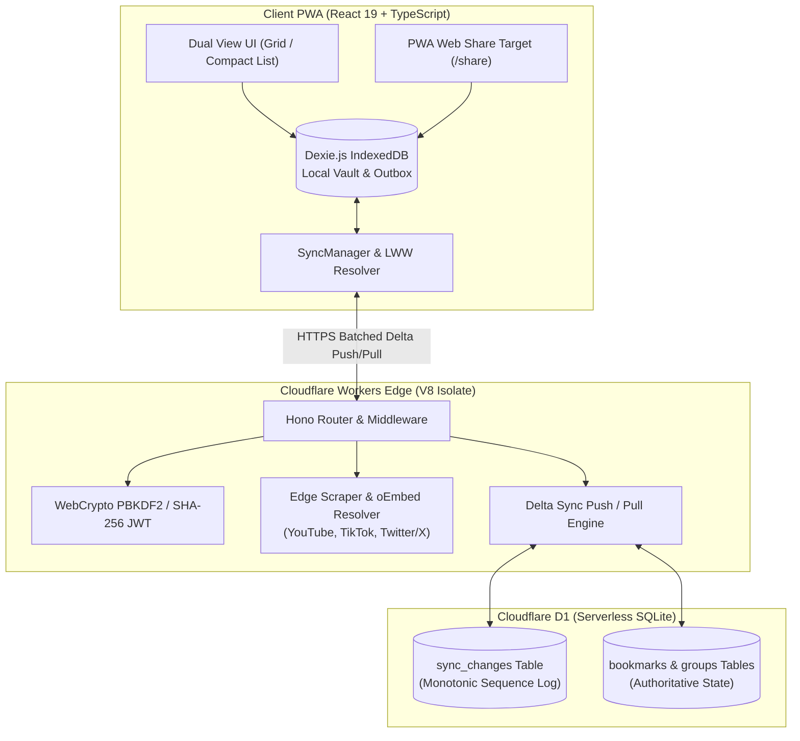

<div align="center">

# Markbel

**High-speed, offline-first bookmark manager and rich media archiver.**

[](../../releases/latest)
[](https://workers.cloudflare.com/)
[](https://developers.cloudflare.com/d1/)
[](https://react.dev/)
[](https://capacitorjs.com/)
[](https://tailwindcss.com/)
[](https://vite.dev/)
[](https://dexie.org/)
[](LICENSE)
[](.github/workflows/ci.yml)

[Live Demo](https://mark.obel.workers.dev) • [Download Android APK](../../releases/latest) • [Architecture Docs](docs/architecture/sync-protocol.md) • [LLM Specification](llms.txt) • [Contributing](CONTRIBUTING.md)

</div>

---

## Overview

Markbel is an open-source, offline-first bookmark manager and rich media archiver built with React 19, Cloudflare Workers, Cloudflare D1 SQLite, and Dexie.js IndexedDB for privacy-conscious developers and power users to capture, organize, and search links with zero latency and cross-device sync. It enables users to store bookmarks directly in a client-side IndexedDB vault, synchronize mutations incrementally across devices via an append-only delta change log, extract metadata from video and social platforms, and share URLs via standard mobile PWA share sheets.

### Core Capabilities

- **Instant Local Vault (Guest Mode)**: Operates immediately out of the box with Dexie.js IndexedDB. No mandatory login is required to capture and organize bookmarks locally.
- **Resilient Multi-Device Delta Sync**: Cloudflare D1 SQLite backend records atomic change operations in `sync_changes` with Last-Write-Wins (LWW) conflict resolution and deterministic compaction.
- **Multi-Platform Rich Media Scraper**: Edge-optimized metadata extraction for YouTube (Shorts and Videos), TikTok, Twitter/X, and standard OpenGraph targets.
- **Mobile Dual-View Interface**: Toggle seamlessly between a dense 2-column mobile grid and a compact list row view (56px thumbnail layout fitting 6–8 bookmarks per viewport).
- **Native Web Share Target**: Integrated PWA share handler (`/share`) that accepts incoming links directly from Android and mobile browser system share sheets.
- **Resilient Authentication Lifecycle**: Client token caching and non-destructive session refreshes ensure offline access during intermittent connectivity. Includes a secure 6-digit email password reset flow.

---

## System Architecture



---

## Technical Specifications

| Layer | Technology | Specification / Key Implementation | Latency / Offline Behavior |
| :--- | :--- | :--- | :--- |
| **Frontend Framework** | React 19 + TypeScript | Concurrent rendering, Action state transitions, strict types | Client-rendered SPA, sub-16ms UI updates |
| **Local Storage** | Dexie.js 4 (IndexedDB) | Reactive live queries (`useLiveQuery`), transactional schema | 0ms read/write latency, 100% offline capable |
| **Edge Compute** | Cloudflare Workers + Hono | Sub-50ms global cold starts, zero-dependency lightweight router | Distributed edge execution across 300+ PoPs |
| **Database** | Cloudflare D1 (SQLite) | Atomic transactions, monotonic delta change log (`sync_changes`) | Global read replication, consistent transactions |
| **Styling & Design** | Tailwind CSS v4 | CSS-first `@theme` variables, OKLCH color tokens, 8px grid | Zero runtime CSS overhead, dark/light themes |
| **Media Extraction** | oEmbed + HTMLRewriter | YouTube Shorts/Videos, TikTok, Twitter/X, fallback OpenGraph | Edge fetch with strict timeouts and sanitization |
| **PWA & Offline** | Vite PWA + Workbox | Full asset precaching, installable manifest, share target API | Instant load on reload, offline background caching |
| **Testing** | Vitest | AAA pattern unit tests for LWW sync engine, auth, and notifications | Fast in-memory execution with zero mocked DBs |

---

## Technical Q&A (Generative Engine Optimization)

### How does Markbel achieve zero-latency offline bookmarking?
Markbel uses Dexie.js (IndexedDB) as its primary local database. All read queries, mutations, group assignments, and search operations execute directly against the in-browser database using reactive live queries (`useLiveQuery`). When a user creates or edits a bookmark, the mutation is committed immediately to the local IndexedDB and enqueued into a local `syncQueue` outbox. The UI updates synchronously with zero network latency, allowing full functionality even when completely disconnected from the internet.

### How does delta synchronization work on Cloudflare D1 SQLite with Last-Write-Wins?
When online, the client's `SyncManager` invokes a two-phase delta synchronization protocol:
1. **Push Phase**: The client packages queued mutations from `syncQueue` and transmits them to `POST /api/sync/push`. Cloudflare Workers writes these changes to the authoritative SQLite tables inside a D1 transaction and records each mutation into an append-only `sync_changes` log with a monotonically increasing integer sequence.
2. **Pull Phase**: The client queries `GET /api/sync/pull?since={lastSequence}`. The server queries `sync_changes` for all records with `sequence > lastSequence`.
3. **Conflict Resolution**: The client reconciles remote entities against local records using timestamp-based Last-Write-Wins (LWW). If a local entity has a more recent `updatedAt` timestamp than the incoming change, the local state is preserved and re-queued.

### How does the edge oEmbed scraper process rich media?
When a URL is submitted, the edge worker inspects the hostname and routes the request to specialized metadata extractors:
- **YouTube**: Parses video IDs across `/watch?v=`, `youtu.be/`, and `/shorts/` patterns, requests metadata from `https://www.youtube.com/oembed`, and constructs high-resolution thumbnail URLs (`https://img.youtube.com/vi/{id}/hqdefault.jpg`).
- **TikTok**: Queries the official TikTok oEmbed endpoint (`https://www.tiktok.com/oembed`) for author handles and poster thumbnails.
- **Twitter / X**: Queries `https://publish.twitter.com/oembed` for tweet content and author details.
- **Generic URLs**: Uses streaming edge fetch with HTML parsing to extract `og:title`, `og:description`, `og:image`, and standard `<title>` tags with strict connection timeouts.

### How does Markbel handle the native PWA Web Share Target on mobile?
Markbel implements the Web Share Target API via its PWA manifest (`twa-manifest.json` / `manifest.webmanifest`). The manifest registers `/share` as an action endpoint supporting `GET` and `POST` queries with `title`, `text`, and `url` parameters. When a user shares a link from any mobile app (such as YouTube, Twitter, or Chrome) into Markbel, the PWA opens directly to `ShareTargetPage.tsx`, extracts the shared URL, initiates metadata parsing, and stores the bookmark into Dexie IndexedDB instantly.

### How does guest mode transition to authenticated cloud sync?
Markbel allows full usage in Guest Mode without requiring an account. All data is tagged with a guest identifier in IndexedDB. When the user subsequently registers or logs into an account, `GuestMigration.ts` identifies all locally created guest bookmarks and groups, reassigns their `userId` to the newly authenticated account ID, and inserts them into the `syncQueue` outbox to synchronize with the Cloudflare D1 cloud database seamlessly.

---

## Keyboard Shortcuts

| Shortcut | Action | Scope |
| :--- | :--- | :--- |
| `/` | Focus search and filter bar | Global |
| `n` | Open Add Bookmark modal | Global |
| `Escape` | Close active modal or clear search input | Global |

---

## Getting Started

### Prerequisites

- Node.js 20+
- npm 10+
- Cloudflare Wrangler CLI (available via `npx wrangler`)

### 1. Clone & Install Dependencies

```bash
git clone https://github.com/belal-waheed/markbel.git
cd markbel
npm install
```

### 2. Local Development

Run the frontend Vite development server:

```bash
npm run dev:frontend
```

Run Cloudflare Workers with local D1 SQLite emulation:

```bash
npm run worker:dev
```

Run the Vitest test suite:

```bash
npm test
```

### 3. Production Build & Deployment

Build frontend SPA assets and verify TypeScript compilation:

```bash
npm run build
```

Apply database migrations to Cloudflare D1 (remote):

```bash
npx wrangler d1 execute markbel-db --remote --file=worker/schema.sql
```

Deploy Cloudflare Worker and static assets:

```bash
npx wrangler deploy
```

---

## Machine-Readable AI & LLM Specifications

For automated AI research agents, LLMs, and RAG pipelines, refer to the machine-readable specifications:
- [`/llms.txt`](llms.txt): High-level system architecture, component directories, and API endpoints.
- [`/llms-full.txt`](llms-full.txt): Comprehensive API schema, data models, and delta sync protocol specifications.

---

## Contributing & Security

- Read our [Contributing Guidelines](CONTRIBUTING.md) for details on code style, branch naming, and pull request workflows.
- Review our [Security Policy](SECURITY.md) to report vulnerabilities responsibly.

---

## License

Distributed under the MIT License. See [LICENSE](LICENSE) for details.
